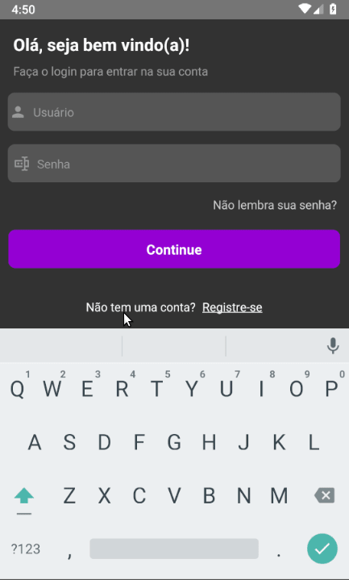

# react-navigate

> Este é um projeto para fixação de conteúdo, sobre navegação entre telas.
> 1. Na tela de login não consegue passar adiante caso não houver preenchido todos os campos, no caso do não preenchimento é exibido um Alerta personalizado.
> 2. Na tela de login foi feito a captação do valor do input e pego o parâmetro na tela de continuação.
> 3. Realizado a devida alteração no arquivo metro.config.js para poder utilizar SVG no projeto.
> 4. Realizado as devidas alterações em /android/app/build.gradle e /android/settings.gradle para utilizar icones.

## Bibliotecas utilizadas
> 1. react, {useState}
> 2. styled-components/native
> 3. react-native
> 4. react-native-vector-icons/MaterialCommunityIcons
> 5. react-native-vector-icons/MaterialIcons
> 6. @react-navigation/native

## Segue abaixo um gif do projeto:

